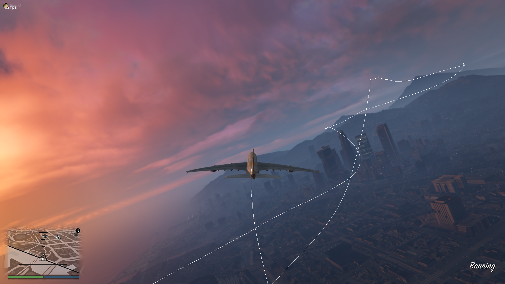

# FiveMPathLogger
 Record a gps-like path of your playermovement in FiveM
 
## Commands
* /path <interval (optional)>  -  toggles path recording
* /pathClear  -  clears the path
* /pathDist  -  calculates path length

